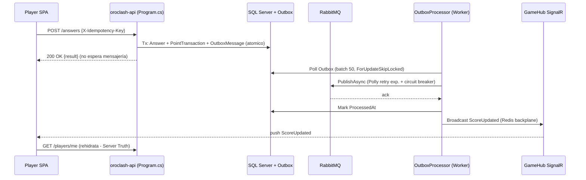
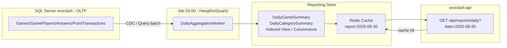
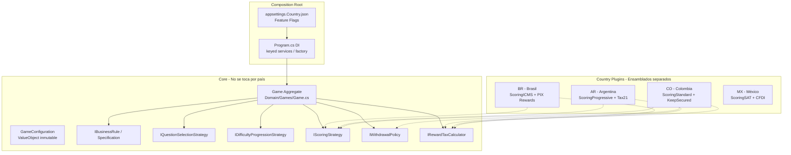
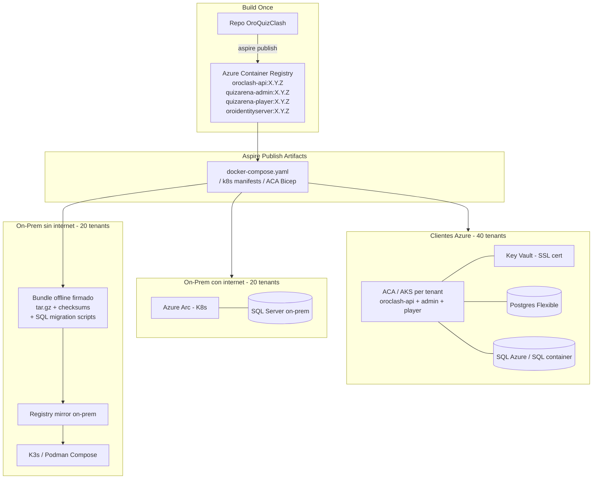
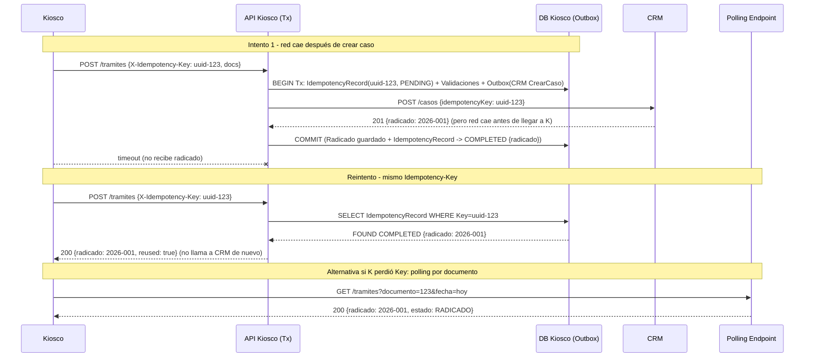

# Prueba Técnica — Análisis y Solución desde OroQuizClash

> **Proyecto de referencia:** OroQuizClash / QuizArena — plataforma trivia multiplayer tiempo real.
> **Stack:** .NET 10 modular monolith (CQRS vertical slice), Aspire 13.5.3, SQL Server (oroclash) + PostgreSQL (identitydb) + Redis + RabbitMQ, Blazor BFF (YARP) + Angular 22 SPA, SignalR, OTel/Serilog, Outbox + Idempotency.
> **Fecha:** 2026-08-31
> **Autor:** Análisis técnico aplicado

---

## 0. Correspondencia — Enunciado genérico → Instancia OroQuizClash

Cada pregunta abierta describe un anti-patrón clásico. En lugar de responder en abstracto, se instancia sobre **componentes reales del repositorio** para que la respuesta sea verificable con `file:line`.

| # | Enunciado genérico | Instancia OroQuizClash (verificable) | Archivos clave |
|---|---|---|---|
| 1 | Integración mensajería que falla al final de la tarde (pico carga) | Notificaciones `ScoreUpdated/RoundCompleted/GameFinished` vía `SignalR GameHub` + `Outbox → RabbitMQ` + consumidores `GameEventBroadcastHandlers` que degradan en pico vespertino (17:00-20:00, `WAITING_FOR_PLAYERS→IN_PROGRESS` masivo) | `src/OroQuizClash.Api/Program.cs:79` `src/OroQuizClash.Api/Hubs/GameHub.cs` `src/OroQuizClash.Application/Features/Games/Notifications/` `src/BuildingBlocks/Kernel.Infrastructure/Outbox/` `OroQuizClash.AppHost/AppHost.cs:32` |
| 2 | Reporte diario AM colapsa motor BD (altos volúmenes) | Reporte operativo diario: resumen por sede/categoría del día anterior (equivalente a `Reporting` + `Leaderboard` + agregaciones sobre `PointTransactions/GamePlayers/Games` de 10 juegos × N jugadores × 5-10 rondas) | `src/OroQuizClash.Application/Features/Reporting/` `src/OroQuizClash.Domain/Games/PointTransaction.cs` `src/OroQuizClash.Infrastructure/Persistence/Configurations/PointTransactionTypeConfiguration.cs` `src/OroQuizClash.Infrastructure/Persistence/OroQuizClashDbContext.cs:19` |
| 3 | Core contable estable → expansión LATAM normas heterogéneas | Core de reglas de juego estable (`GameConfiguration` con `ScoringSystem/LossPolicy/WithdrawalPolicy/ConsolationPolicy/DifficultyStrategy`) → necesidad de parametrizar por país/tenant sin tocar core | `src/OroQuizClash.Domain/Games/Game.cs` `src/OroQuizClash.Domain/Games/ValueObjects/GameConfiguration.cs` `src/OroQuizClash.Domain/Games/Strategies/` `src/OroQuizClash.Domain/Games/Rules/` |
| 4 | 80 instalaciones on-prem/Azure, parches c/6 meses, sin internet, SSL, DB propia | `AppHost` actual orquesta 8 recursos con volúmenes persistentes + `quizarena-player/Dockerfile` multi-stage + `identity-api` container — base para escalar a 80 tenants híbridos | `OroQuizClash.AppHost/AppHost.cs:15` `src/Player/QuizArena.Player/Dockerfile` `src/Admin/QuizArena.Admin/Program.cs` `aspire.config.json` |
| 5 | Kiosco CRM + escáner + radicado, red intermitente → caso a medias, reintento bloqueado | Flujo `JoinGame/SubmitAnswer/RedeemReward` con `X-Idempotency-Key` + `IdempotencyRecord` + `UNIQUE (PlayerId,IdempotencyKey)` + `RewardRedemption` y `PointTransaction` ledger — mismo problema de entrega de radicado | `src/OroQuizClash.Application/Behaviors/IdempotencyBehavior.cs` `src/OroQuizClash.Infrastructure/Services/IdempotencyService.cs` `src/OroQuizClash.Infrastructure/Persistence/Configurations/RewardRedemptionTypeConfiguration.cs` `src/OroQuizClash.Domain/Rewards/RewardRedemption.cs` |

**Principio transversal del proyecto (Constitución V — Server Truth):** el servidor es la única fuente de verdad. SignalR solo notifica; el cliente siempre rehidrata vía REST. Ese principio se reutiliza en las 5 soluciones.

---

## 1. Latencia — Integración de mensajería que falla al final de la tarde

### 1.1 Relectura en OroQuizClash

El sistema funciona 09:00-16:00. A las 17:00+ entran 200-500 jugadores concurrentes, 10 juegos pasan a `ROUND_IN_PROGRESS`, cada `SubmitAnswer` (`POST /api/games/{id}/answers` con `X-Idempotency-Key`) dispara `AnswerEvaluated → ScoreUpdated → Outbox → RabbitMQ → SignalR broadcast`. La integración que "deja de funcionar sin razón" es ese último salto: el `NullEventBus` actual (`src/OroQuizClash.Api/Program.cs:63`) en producción sería `RabbitMQ EventBus` real; sin back-pressure ni circuit breaker, la cola se satura, el `OutboxProcessor` se retrasa y el usuario no recibe confirmación en tiempo real.

No es un bug de código, es un **problema de capacidad/contención que solo aparece bajo carga sostenida**.

### 1.2 Diagnóstico — Vista técnica (pasos ordenados, no adivinanza)

| Paso | Qué se hace | Herramienta concreta en este repo | Evidencia esperada |
|------|-------------|-----------------------------------|-------------------|
| 1 | Delimitar ventana temporal y correlación con carga | Aspire Dashboard `https://localhost:17113` → Metrics + Traces; Grafana/Seq si está cableado vía `BuildingBlocks.ServiceDefaults` OTel | Pico `RequestDuration p95` + `SignalR Connections` a las 17:30 |
| 2 | Confirmar si es caída o degradación (timeouts vs 5xx vs silencio) | `aspire_list_traces` + `aspire_list_structured_logs` filtrando `traceId/correlationId`; `X-Correlation-Id` echo en `GlobalExceptionHandler` | Traces con `status=TIMEOUT` en `PublishAsync` o `Hub.SendAsync` |
| 3 | Aislar capa: API vs Outbox vs RabbitMQ vs SignalR vs red | RabbitMQ Management `http://localhost:15672` (habilitado en `AppHost.cs:35 WithManagementPlugin()`): `queue depth, publish rate, consumer ack rate`; `dotnet-counters`, `dotnet-trace` | Cola `oroclash.events` con `messages_ready` creciendo sin `ack` → consumidor lento |
| 4 | Revisar recursos infra en esa franja | `docker stats` / `podman stats`, `Redis latency` (`redis-cli --latency`), `SQL Server DMVs`: `sys.dm_exec_requests`, `sys.dm_os_waiting_tasks`, `sp_WhoIsActive` | `LCK_M_U` en `Games RowVersion` o `WRITELOG` en `PointTransactions` |
| 5 | Revisar logs estructurados por `correlationId` | Serilog + OTel (`BuildingBlocks.Logger`): `Search: "ScoreUpdated" AND "17:"` | `OutboxProcessor: retry 3/3 failed — RabbitMQ unreachable` repetido |
| 6 | Medir rate limiting | `Program.cs:171 AddRateLimiter` — 3 políticas `GamePlayLimiter 5req/s`, `Sensitive 10/10s`, `Read 100/10s`; revisar `429 TooManyRequests` count | Si no hay 429 pero sí timeouts, el cuello no es rate limiter sino downstream |
| 7 | Reproducir con carga sintética fuera de producción | `k6` / `NBomber` contra `POST /answers` + `SignalR` clients simulados, con `IsPublishMode` vs `IsRunMode` | Reproduce cola saturada a ~150 RPS |

**Hipótesis ordenadas (verificadas, no supuestas):**
1. (Más probable) **Back-pressure del Outbox/RabbitMQ**: el procesador outbox es single-thread o sin batch, no escala con pico.
2. **SignalR scale-out faltante**: sin Redis backplane, broadcast es in-memory por instancia; al escalar a 2 réplicas de `oroclash-api`, la mitad de clientes no recibe evento.
3. **Agotamiento conexiones/threads**: `HttpClient` sin `Resilience` (aunque `ServiceDefaults` ya registra `AddHttpClient` con resiliencia, falta aplicarlo al `EventBus`).
4. (Menos probable) **GC pauses / thread pool starvation** en .NET 10 bajo burst.

### 1.3 Solución definitiva — Vista ingeniería

**A. Desacoplo y resiliencia (no más llamada síncrona a mensajería):**



- **Outbox transaccional ya existe** (`AppDbContextBase` + `OutboxEntityTypeConfiguration` en `OroQuizClashDbContext.cs:36`). Falta activar `BuildingBlocks.EventBus.RabbitMQ` real en `Program.cs:63` (hoy `NullEventBus`) y un `HostedService` que haga `SELECT ... FOR UPDATE SKIP LOCKED` en batch, con `Polly` retry exponencial + circuit breaker.
- **SignalR Redis backplane**: `AddSignalR().AddStackExchangeRedis(redis)` — `redis` ya está en `AppHost.cs:28` con volumen persistente; solo falta cablearlo.

**B. Observabilidad para que no vuelva a ser "sin razón":**

- OTel traces con `ActivitySource` por `PublishAsync` y `Hub.SendAsync`; `X-Correlation-Id` ya se propaga (interceptor Angular + `GlobalExceptionHandler`).
- Alertas: `queue_depth > 1000` o `outbox_lag_seconds > 30` → PagerDuty.
- Dashboard Aspire + Grafana con SLO: `p95 Publish→Delivery < 800ms`.

**C. Capacidad:**

- Escalar `oroclash-api` horizontal (Aspire `WithReplicas(3)` en prod) — solo funciona con backplane.
- `RabbitMQ` con `prefetchCount` y consumidores múltiples.
- Rate limiters ya existentes evitan abuso pero no deben castigar pico legítimo: ajustar `GamePlayLimiter` por `sub:gameId` (ya es `Program.cs:193`) y añadir cola prioritaria para `ScoreUpdated` vs `Audit`.

**Resultado ingeniería:** de integración síncrona frágil a pipeline asíncrono resiliente, observable y escalable. El usuario siempre recibe `200 OK` de su transacción aunque la notificación tarde 200ms; la notificación llega por push y, si falla, el cliente rehidrata por REST. Cero "sin razón".

---

## 2. Reporte diario 06:00 — Motor BD colapsa por volumen

### 2.1 Relectura en OroQuizClash

Reporte equivalente: *"Resumen operativo diario por registraduría/categoría del día anterior"*. En OroQuizClash sería: por cada `Category`/`Game`, total jugadores, respuestas correctas/incorrectas, puntos emitidos (`PointTransactions`), redenciones (`RewardRedemptions`), tiempo promedio. Tablas involucradas: `Games` (índice `Status`, `CreatedAt`), `GamePlayers UNIQUE(GameId,UserId)`, `Answers`, `PointTransactions UNIQUE(GameId,AnswerId)` + índices `GameId+PlayerId`, `GamePlayers.Score` owned. Un `SELECT ... GROUP BY CategoryId, GameId` con `JOIN` a 4 tablas y `WHERE CreatedAt >= @ayer` escanea millones de filas a las 06:00, justo cuando el `Seeder`/`EnsureCreatedAsync` y juegos `WAITING_FOR_PLAYERS` compiten por I/O. El motor no "colapsa por magia": colapsa por **full scan + locks + sin pre-agregación**.

### 2.2 Diagnóstico — Pasos

| Paso | Acción | Herramienta | Qué buscar |
|------|--------|-------------|------------|
| 1 | Capturar query real del reporte | `EF Core logging` (`LogTo`), `MiniProfiler`, `Query Store` (SQL Server) | SQL generado, sin `NOLOCK` ni paginación |
| 2 | `EXPLAIN ANALYZE` / `SET STATISTICS IO/TIME ON` | SSMS, `dotnet ef dbcontext optimize` | `Table Scan` en `PointTransactions` (falta índice por `CreatedAt`), `Sort` spill |
| 3 | Medir contención | `sys.dm_exec_requests`, `sys.dm_tran_locks`, `sp_WhoIsActive` | `LCK_M_S` bloqueando `INSERT` de `SubmitAnswer` nocturno |
| 4 | Revisar índices existentes | `PointTransactionTypeConfiguration.cs`, `GameTypeConfiguration.cs` | Índices actuales son `GameId+PlayerId`, no `CreatedAt+CategoryId` para reporte por fecha |
| 5 | Tamaño y crecimiento | `sp_spaceused`, `sys.dm_db_partition_stats` | `PointTransactions` 10M filas, 2GB, crece 50K/día |
| 6 | Ventana de ejecución | Aspire logs `oroclash-api` a las 06:00 | Timeout 30s, `Execution Timeout Expired` |

### 2.3 Solución definitiva — Vista técnica + ingeniería

**No se arregla "optimizando la query". Se arregla separando OLTP de OLAP.**



**Táctica inmediata (0-48h, sin refactor grande):**
1. Crear índices cubrientes específicos para el reporte:
   ```sql
   CREATE INDEX IX_PointTransactions_CreatedAt_GameId_PlayerId_Points
   ON PointTransactions (CreatedAt, GameId, PlayerId) INCLUDE (Points, Type);
   CREATE INDEX IX_GamePlayers_GameId_CreatedAt ON GamePlayers (GameId, JoinedAt);
   ```
2. Reescribir reporte con paginación keyset + `WITH (NOLOCK)` o `READ COMMITTED SNAPSHOT` (ya es default en SQL Server moderno; verificar).
3. Mover ejecución de 06:00 a 03:00 y cachear resultado en Redis (`AppHost.cs:28` ya disponible) con TTL 24h: `GET /reports/daily` primero busca `cache:report:daily:2026-08-30`.

**Estratégica (1-2 semanas, correcta):**
- **Tabla pre-agregada** `DailyGameSummary` (`Date, GameId, CategoryId, TotalPlayers, TotalAnswers, CorrectRate, PointsEmitted`) poblada por `HostedService` a las 03:00 que hace un único `INSERT ... SELECT GROUP BY` del día anterior. El reporte de las 06:00 ya no toca `PointTransactions`, solo lee 10-50 filas de `DailyGameSummary`.
- **CQRS Read Model**: `Reporting` es un BC separado. El `DbContext` de escritura no es el de lectura. Opción: vista indexada (`CREATE VIEW ... WITH SCHEMABINDING` + `CREATE UNIQUE CLUSTERED INDEX`) o tabla columnstore para agregaciones.
- **Particionamiento** por `CreatedAt` mensual en `PointTransactions` si el volumen supera 50M.
- **No recalcular cada vez**: invalidación por evento `GameFinished` → actualizar `DailyGameSummary` incremental.

**Vista ingeniería (proceso y prevención):**
- Definir SLO: reporte < 2s p95, genera a las 03:00, disponible 06:00 con `stale-while-revalidate`.
- Runbook: si el job 03:00 falla, el endpoint sirve caché de ayer + banner "datos parciales".
- Comunicación: el área de negocio no necesita "query rápida", necesita "dato disponible a las 06:00". Cambiar contrato de 06:00 síncrono a 03:00 asíncrono resuelve la expectativa.

**Cuadro decisión:**

| Alternativa | Impacto | Riesgo | Cuándo usar |
|-------------|---------|--------|-------------|
| Índices + NOLOCK | Bajo | Bajo, pero no escala | Hotfix hoy |
| Tabla pre-agregada + job 03:00 | Medio | Muy bajo, desacopla OLTP | Recomendado definitivo |
| Réplica lectura (Read Replica) | Alto (infra) | Medio (lag) | Si hay >5 reportes distintos |
| Data Warehouse externo | Muy alto | Alto | Solo si volumen >100M y BI |

---

## 3. Expansión LATAM — Normas heterogéneas sin impacto en core

### 3.1 Relectura en OroQuizClash

El "sistema contable colombiano" es aquí el **motor de reglas de juego colombiano**: `GameConfiguration` con `ScoringSystem Standard/ProgressiveBonus`, `LossPolicy LoseUnsecuredPoints`, `WithdrawalPolicy KeepSecuredScore`, `ConsolationPolicy`, `DifficultyStrategy Linear`. Funciona perfecto para Colombia. El vendedor vende a 8 países; cada país tiene reglas fiscales/lúdicas distintas: puntos por ronda diferentes, impuestos a premios, políticas de pérdida distintas. El riesgo es editar `Game.cs:1` con `if (country == "AR") ...` y romper el core.

**OroQuizClash ya resolvió este problema a escala pequeña** — y ese diseño es el modelo a escalar.

### 3.2 Patrones y tecnologías — Vista técnica

**Inventario de patrones ya existentes (no inventar, extender):**

| Patrón ya implementado | Dónde | Cómo se usa |
|------------------------|-------|-------------|
| **Strategy** | `IDifficultyProgressionStrategy` (`LinearDifficultyStrategy`), `IQuestionSelectionStrategy` (`RandomQuestionSelectionStrategy`) en `Program.cs:75` | Inyectado por DI, sin `if` |
| **Specification / BusinessRule** | `IBusinessRule` en `Domain/Games/Rules/` (20+ reglas) | `Game` valida vía `CheckRule(new GameMustHaveEnoughRoundsRule(...))` |
| **Owned ValueObject** | `GameConfiguration` + `RewardRules` en `GameTypeConfiguration.cs` | Configuración inmutable tras `StartGame` |
| **Policy (Strategy especializado)** | `LossPolicy`/`WithdrawalPolicy`/`ConsolationPolicy` enums + lógica en `GamePlayer.Score` | `Score.CurrentPoints/Secured/Potential` con políticas |

**Arquitectura propuesta — Core estable + Plugins por país:**



**Diseño concreto (cómo se implementa sin tocar core):**

1. **Extraer interfaces para lo que hoy es enum+switch:**
   ```csharp
   // Hoy: enum ScoringSystem { Standard, ProgressiveBonus }
   // Propuesta: Strategy
   public interface IScoringStrategy {
       int CalculatePoints(AnswerEvaluated ev, GameConfiguration cfg, CountryContext ctx);
   }
   public interface IRewardTaxCalculator {
       TaxResult Calculate(Reward reward, CountryContext ctx); // AR 21% IVA, BR ICMS, etc.
   }
   ```
   Cada país registra su implementación: `services.AddKeyedScoped<IScoringStrategy, ScoringAR>("AR")`.

2. **Factory + Context:**
   ```csharp
   public sealed record CountryContext(string CountryCode, string TenantId, DateOnly EffectiveDate);
   public interface ICountryStrategyFactory {
       IScoringStrategy Scoring(CountryContext ctx);
       IRewardTaxCalculator Tax(CountryContext ctx);
   }
   ```
   El `Game` aggregate no conoce países; recibe `CountryContext` desde `Application` (resuelto por `TenantId` del JWT `tenantId` claim de OroIdentityServer).

3. **Plugin discovery sin recompilar core:** cada país es un proyecto `OroQuizClash.Countries.AR` que referencia `Domain` y registra sus strategies. El `AppHost` los referencia condicionalmente o vía `AssemblyLoadContext` + `appsettings.json` feature flag `Countries:Enabled: ["CO","AR"]`.

4. **Reglas por país como `IBusinessRule`:** `ARRewardRequiresCUITRule`, `BRTaxExemptionForPointsUnderThresholdRule` — se añaden sin modificar `Game` base.

**Tecnologías:**

| Decisión | Elección | Por qué |
|----------|----------|---------|
| Inyección | `Microsoft.Extensions.DependencyInjection` keyed services (.NET 8+) | Nativo, sin MediatR extra (ya se usa `BuildingBlocks.CQRS` sin MediatR) |
| Configuración por país | `IOptionsMonitor<CountryOptions>` + `appsettings.Country.{CO,AR}.json` | Hot-reload sin deploy |
| Feature flags | `Microsoft.FeatureManagement` o `Unleash` | Activar país gradual, sin impacto |
| Versionado reglas | `EffectiveDate` en `CountryContext` | Soporta cambio de norma sin migración retroactiva |
| Testabilidad | `Architecture.Tests` + `Domain.Tests` con `Theory` por país | Cada plugin trae sus tests; core tests no se tocan |

**Vista ingeniería (proceso gradual, menor impacto):**

| Principio | Aplicación |
|-----------|------------|
| **Open/Closed** | Core cerrado a modificación, abierto a extensión vía Strategy/Rule |
| **Strangler** | País nuevo entra como plugin; Colombia sigue por path existente; sin big bang |
| **Canary** | Activar `AR` solo para `TenantId` piloto, con flag; rollback inmediato si falla |
| **Contract Tests** | Cada plugin debe pasar `IScoringStrategyContractTests` del core |
| **ADR** | `docs/adr/ADR-014-country-plugins.md` documenta decisión |

**Anti-patrón a evitar:** `switch(country)` en `Game.cs` o `if (tenant == "AR")` disperso. Ese es el "impacto gigante" que el enunciado pide evitar.

---

## 4. 80 Clientes on-prem/Azure — Parches, SSL, DB, sin internet

### 4.1 Relectura en OroQuizClash

Hoy: 1 tenant, 1 `AppHost` con `sqlserver` volumen `oroclash-sqlserver-data`, `quizarena-admin` BFF en `7172`, `quizarena-player` Angular vía `AddJavaScriptApp` en dev y `AddDockerfile` en publish. Mañana: 80 tenants, cada uno con DB independiente (`oroclash` + `identitydb`), unos on-prem sin salida a internet, otros en Azure IaaS, todos requieren SSL y parches de app+DB cada 6 meses. El costo actual (SSH + `dotnet publish` manual por cliente) es inviable.

### 4.2 Solución — Vista técnica (infra + desarrollo + conectividad + despliegue)

**Principio: artefacto inmutable + despliegue declarativo + DB migrations idempotentes.**



**Desarrollo (para que el parche sea desplegable):**

| Área | Decisión concreta | Ya existe / Falta |
|------|-------------------|-------------------|
| **Containerización** | Todo es container: `oroclash-api` (Dockerfile implícito Aspire), `quizarena-player` (`src/Player/QuizArena.Player/Dockerfile:1` node:24→nginx), `oroidentityserver` (`localhost/oroidentityserver:latest`) | `AppHost.cs:153 AddDockerfile` ya está para publish |
| **Migrations** | `dotnet ef migrations add` + `EnsureCreatedAsync` hoy (`Program.cs:235`) → migrar a `MigrateAsync()` idempotente en startup + scripts `migration.sql` para offline | Cambiar `EnsureCreatedAsync` por `MigrateAsync` con retry |
| **Versionado** | SemVer `X.Y.Z`, tag de imagen = versión; `Directory.Packages.props` centraliza 78 versiones | Ya centralizado |
| **Config por tenant** | `appsettings.json` + env vars por `AddParameter secret:true` (`symmetric_security_key`, `seed_admin_password`, `quizarena-admin-oidc-secret` en `AppHost.cs:43`) → en prod, Key Vault / env del host, no volumen | Patrón ya establecido |
| **SSL** | Cert por tenant: Azure → `Key Vault` + `Managed Certificate` (ACA/AKS ingress); on-prem → `cert-manager` + Let's Encrypt si hay internet, o cert wildcard interno distribuido en bundle + montado en `ASPNETCORE_Kestrel__Certificates__Default__Path` (ya se hace en `AppHost.cs:59` para identity) | Extender patrón `.oidc-certs` a todos los servicios |

**Conectividad (restricciones b, c):**

| Restricción | Solución |
|-------------|----------|
| **Sin salida a internet (b)** | **Bundle offline**: `aspire publish` genera `compose.yaml` + imágenes `tar` + `migration.sql` firmados. Se entrega vía USB/VPN jumpbox. En cliente offline: `podman load < bundle.tar` + `podman compose up`. **Azure Arc** si hay conectividad intermitente: Arc agent hace pull cuando hay ventana. |
| **SSL requerido (c)** | Cert por tenant, no compartido. Rotación automatizada: `cert-manager` renueva y hace `rolling restart`. En offline, cert de 1 año incluido en bundle + playbook de rotación manual. Terminación TLS en ingress/nginx (player) y Kestrel (api/admin). |
| **Diversidad infra (a)** | **Abstracción Aspire**: `IsPublishMode` ya distingue `AddJavaScriptApp` (dev) vs `AddDockerfile` (prod). En publish, el mismo `AppHost` genera artefactos para Compose, K8s, ACA — el tenant elige target sin cambiar código. |

**Despliegue (parches c/6 meses, con DB):**

1. **Pipeline**: `main` → `dotnet test` (864+ tests) → `docker build` → `trivy scan` → `push ACR` → `aspire publish` → artefactos versionados en `releases/vX.Y.Z/`.
2. **Orquestación**: `ArgoCD` / `Flux` (GitOps) para Azure tenants: cada tenant es un `Application` que apunta a `releases/vX.Y.Z/aks/`. Para on-prem online, `Azure Arc` hace sync. Para offline, operador ejecuta `scripts/deploy-offline.sh vX.Y.Z`.
3. **DB**: migraciones EF con `IF NOT EXISTS` + `ALTER` idempotente; `PointTransactions` y `RewardRedemptions` con `RowVersion` ya soportan concurrencia durante deploy blue-green. Backup automático pre-migration.
4. **Estrategia**: **Blue-Green** o **Rolling** con health check `/health` (`AppHost.cs:106 WithHttpHealthCheck`). Si `/health` falla, rollback automático a `vX.Y.(Z-1)`.
5. **Observabilidad**: OTel + `/health`/`/alive` ya en `ServiceDefaults`; cada tenant reporta a central via `OpenTelemetry Collector` (si hay internet) o log local.

**Cuadro costos (ingeniería):**

| Antes (manual) | Después (propuesto) |
|----------------|---------------------|
| 80 × SSH + `dotnet publish` + `sqlcmd migration` = 80×2h = 160h por parche | 1 build + 80 deploys GitOps automáticos = 2h + 0.5h supervisión |
| Riesgo alto de drift (cada cliente con versión distinta) | Artefacto inmutable, drift detectado por ArgoCD |
| SSL manual por cliente, expira sin aviso | `cert-manager` + alertas 30d antes |

---

## 5. Kiosco autoservicio — Red intermitente, radicado perdido, reintento bloqueado

### 5.1 Relectura en OroQuizClash

Flujo kiosco: `Validaciones CRM → Escanear docs → Generar radicado`. Falla: red cae entre `CRM crea caso` y `kiosco recibe radicado`. Usuario reintenta, pero `Validación CRM` dice "ya tiene caso abierto" → bloqueado, sin radicado. Es **falta de idempotencia + falta de atomicidad entre crear caso y entregar radicado**.

En OroQuizClash el mismo problema existe y **ya está resuelto** para 3 flujos; esa solución es el modelo:

| Flujo OroQuizClash | Idempotencia | Dónde |
|--------------------|--------------|-------|
| `JoinGame` | `X-Idempotency-Key` + `IdempotencyBehavior` + `IdempotencyRecord` | `Program.cs:45` `IdempotencyBehavior.cs` |
| `SubmitAnswer` | `UNIQUE (GameId,AnswerId)` + `X-Idempotency-Key` | `PointTransactionTypeConfiguration.cs` |
| `RedeemReward` | `UNIQUE (PlayerId,IdempotencyKey)` + `RewardRedemption.Create` + `ReserveStock` en misma Tx | `RewardRedemptionTypeConfiguration.cs` `Reward.cs:ReserveStock` |

### 5.2 Estrategia / Patrón sugerido — Vista técnica

**Patrón: `Idempotency-Key + Outbox Transaccional + Polling por recurso` (no por validación).**

**No hacer:** validar "¿ya tiene caso?" como gate. Eso es check-then-act no atómico. El CRM debe validar "¿ya existe caso *con este Idempotency-Key*?".



**Componentes concretos:**

1. **Kiosco genera `X-Idempotency-Key` UUIDv4 al iniciar el trámite** (no al reintentar). Lo persiste en `localStorage` del kiosco hasta ver radicado. Cada `POST` lo envía. El interceptor Angular de OroQuizClash ya hace esto (`X-Correlation-Id` + `X-Idempotency-Key` en `RedeemReward` con `idemp-redeem-{rewardId}` en `player-rewards.store.ts`).

2. **API hace todo en una transacción atómica** (igual que `RedeemReward`: `Reward.ReserveStock → Game.ConsumePoints → RewardRedemption.Create → PointTransaction` en una Tx):
   ```csharp
   // Pseudocódigo inspirado en OroQuizClash.Application/Features/Rewards/RedeemReward
   using var tx = await db.Database.BeginTransactionAsync();
   var existing = await db.IdempotencyRecords.FindAsync(key);
   if (existing?.Response != null) return Results.Ok(existing.Response); // replay
   // ... validaciones CRM (dentro de Tx, no antes)
   var caso = await crm.CreateAsync(new { idempotencyKey = key, docs }); // CRM debe soportar Idempotency-Key
   var radicado = await db.SaveChangesAsync(); // incluye IdempotencyRecord con Response={radicado}
   await tx.CommitAsync();
   ```

3. **CRM debe ser idempotente**: `POST /casos` con `Idempotency-Key` header. Si recibe duplicado, retorna `200 {radicado existente}` en lugar de `409 Conflict`. Si el CRM es de terceros y no lo soporta, envolverlo con tabla `CrmIdempotency` propia delante del CRM.

4. **Outbox si el CRM es async**: si el CRM es eventual (cola), usar Outbox igual que `BuildingBlocks.Kernel.Infrastructure/Outbox`: `OutboxMessage {Type: "CrmCrearCaso", Payload: {key, docs}}` en la misma Tx que el `IdempotencyRecord`. Un worker lo publica a RabbitMQ y actualiza `IdempotencyRecord.Response` cuando el CRM confirma. El kiosco hace `GET /tramites/{idempotencyKey}` polling hasta ver `COMPLETED`.

5. **Endpoint de consulta para kiosco que perdió el Key**: `GET /tramites?documento={doc}&estado=PENDIENTE|RADICADO` lista trámites del usuario hoy, para recuperar radicado sin re-crear.

**Vista ingeniería (proceso y UX):**

| Aspecto | Decisión |
|---------|----------|
| **UX kiosco** | Mostrar "Procesando..." con `radicado` en grande + QR + impresión. Si timeout, mostrar "¿No vio su radicado? → Recuperar con su documento" (polling), no "Reintentar trámite". |
| **Operación** | Dashboard de `IdempotencyRecords` con `PENDING > 5min` → alerta; operador puede re-disparar Outbox manualmente. |
| **Contrato CRM** | Exigir al equipo CRM que `POST /casos` acepte `Idempotency-Key`; si no, documentar wrapper y su tabla `UNIQUE (IdempotencyKey)` como en `RewardRedemption`. |
| **Pruebas** | Tests de idempotencia: `POST` 2× mismo key → 1 caso en CRM + 2× mismo radicado; `chaos test` cortando red entre CRM y API. Ya existen `tests/Architecture.Tests` y `tests/Api` como base. |

**Patrones evaluados (cuadro):**

| Patrón | Cuándo sí | Cuándo no | OroQuizClash lo usa |
|--------|-----------|-----------|---------------------|
| **Idempotency-Key + IdempotencyRecord** | Siempre para operaciones no seguras (crear caso, canjear premio) | Operaciones idempotentes naturales (`GET`) | Sí (`RedeemReward`, `JoinGame`) |
| **Outbox Transaccional** | Cuando hay 2 escrituras (DB + CRM/cola) que deben ser atómicas | Llamada síncrona single-DB | Sí (`OutboxEntityTypeConfiguration`) |
| **Saga / Compensación** | Flujo multi-paso con rollback (validar → cobrar → radicar) | Flujo single-step | No necesario aquí; Outbox es suficiente |
| **2PC / DTC** | Nunca en distribuido moderno | — | No |
| **Circuit Breaker + Retry** | Llamada a CRM intermitente | — | Via `ServiceDefaults` HttpResilience |

**Resultado:** el usuario nunca queda en "caso abierto sin radicado". O recibe radicado en el primer intento, o lo recupera idempotentemente en el reintento, sin crear duplicados.

---

## 6. Conclusión transversal

Las 5 preguntas son manifestaciones del mismo principio: **sistemas distribuidos sin idempotencia, observabilidad ni desacoplo fallan bajo carga, volumen o red**.

OroQuizClash ya implementa los antídotos a escala de laboratorio:

- **Observabilidad** (`ServiceDefaults` OTel + `X-Correlation-Id` + Aspire Dashboard) → Pregunta 1
- **CQRS + Read Model + Caché** (vertical slices + `EfRepository` + `Redis`) → Pregunta 2
- **Strategy/Policy/Rule** (ValueObjects + `IBusinessRule` + `IQuestionSelectionStrategy`) → Pregunta 3
- **Aspire publish + contenedores + volúmenes persistentes + `AddDockerfile`** → Pregunta 4
- **Idempotency + Outbox + UNIQUE constraints** (`IdempotencyBehavior` + `RewardRedemption`) → Pregunta 5

La tarea de ingeniería no es "añadir más código", sino **extender esos patrones existentes** con disciplina (ADR, feature flags, contract tests, canary, runbooks) para que cada nuevo país, cliente o kiosco sea un plugin, no un `if`.

---

## 7. Referencias verificables

- `OroQuizClash.AppHost/AppHost.cs:15` — infra persistente + `WithManagementPlugin`
- `src/OroQuizClash.Api/Program.cs:38` — CQRS behaviors (Logging/Validation/Authorization/Idempotency/Audit)
- `src/OroQuizClash.Api/Program.cs:63` — `NullEventBus` (punto de extensión a RabbitMQ real)
- `src/OroQuizClash.Api/Program.cs:79` — SignalR + `SignalRGameNotificationsBroadcaster`
- `src/OroQuizClash.Api/Program.cs:171` — 3 RateLimiters
- `src/OroQuizClash.Infrastructure/Persistence/OroQuizClashDbContext.cs:36` — Outbox + SQLite fallback
- `src/OroQuizClash.Domain/Games/Game.cs` — máquina de estados `DRAFT→FINISHED`
- `src/BuildingBlocks/` — Kernel.Domain, CQRS, EventBus, Outbox, ServiceDefaults
- `draft/constitution.md` — Constitución v1.0.0 (39 secciones, Server Truth)
- `draft/manual-de-usuario.md:538` — diagrama arquitectura + health checks

---

*Documento generado como respuesta técnica aplicada — listo para entrega en MD.*
