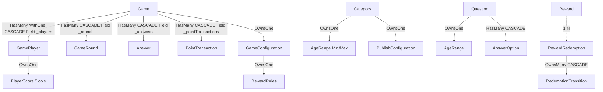

# 02 — Modelo Entidad-Relación + Relaciones — OroQuizClash

> **Base de datos principal:** `oroclash` (SQL Server `sqlserver/oroclash`) — `OroQuizClashDbContext` (`src/OroQuizClash.Infrastructure/Persistence/OroQuizClashDbContext.cs:17`)  
> **Base aislada:** `identitydb` (PostgreSQL `postgres/identitydb` — OroIdentityServer, fuera del alcance de este ER)  
> **ORM:** EF Core 9 + `AppDbContextBase` + `EfRepository` + `SpecificationEvaluator`, `RowVersion` optimista, conversiones `Enumeration`  
> **Fecha:** 31-08-2026

---

## 1. Diagrama ER (Mermaid) — DB `oroclash`

```mermaid
erDiagram
    Games ||--o{ GamePlayers : "1:N (FK GameId, CASCADE, UNIQUE GameId+UserId)"
    Games ||--o{ GameRounds : "1:N (FK GameId, CASCADE)"
    Games ||--o{ Answers : "1:N (FK GameId, CASCADE)"
    Games ||--o{ PointTransactions : "1:N (FK GameId, CASCADE)"
    Categories ||--o{ Questions : "1:N (FK CategoryId, index)"
    Questions ||--o{ AnswerOptions : "1:N (FK QuestionId, CASCADE, UNIQUE Q+DisplayOrder)"
    Rewards ||--o{ RewardRedemptions : "1:N (FK RewardId)"
    RewardRedemptions ||--o{ RedemptionTransitions : "1:N (Owned, FK RewardRedemptionId)"
    Games ||--o{ RewardRedemptions : "1:N (FK GameId, opcional por consolation)"

    Games {
        uniqueidentifier Id PK "GameId"
        nvarchar_100 Name
        int StatusId "GameStatus 1..9"
        rowversion RowVersion
        datetimeoffset CreatedAt
        datetimeoffset ReadyAt nullable
        datetimeoffset StartedAt nullable
        datetimeoffset FinishedAt nullable
        uniqueidentifier CreatedBy
        uniqueidentifier CategoryId "Owned GameConfiguration"
        int MinRounds
        int MaxRounds
        int InitialDifficulty
        int DifficultyStrategyId
        int TimeLimitSeconds
        int ScoringSystemId
        int LossPolicyId
        int WithdrawalPolicyId
        int ConsolationPolicyId
        int MinPlayers
        int MaxPlayers
        int PointsPerRound
        nvarchar_50 RewardRules_Type
        int RewardRules_Threshold
    }
    GamePlayers {
        uniqueidentifier Id PK "GamePlayerId"
        uniqueidentifier GameId FK
        uniqueidentifier UserId "sub de OroIdentityServer"
        datetimeoffset JoinedAt
        nvarchar_null DisplayName
        int CurrentPoints "PlayerScore.Owned"
        int SecuredPoints
        int RoundPoints
        int PotentialPoints
        int TotalPoints
        int ParticipationStatusId "Active/Withdrawn/Eliminated/Winner"
        int CurrentRoundNumber
        datetimeoffset ExitedAt nullable
        rowversion RowVersion
    }
    GameRounds {
        uniqueidentifier Id PK "GameRoundId"
        uniqueidentifier GameId FK
        int RoundNumber
        int Difficulty "1..5"
        uniqueidentifier QuestionId FK "Question"
        int TimeLimit "5..300"
        int StatusId "RoundInProgress/RoundCompleted"
        datetimeoffset StartedAt
        datetimeoffset CompletedAt nullable
    }
    Answers {
        uniqueidentifier Id PK "AnswerId"
        uniqueidentifier GameId FK
        uniqueidentifier PlayerId "UserId"
        uniqueidentifier RoundId FK "GameRound"
        uniqueidentifier QuestionId FK
        uniqueidentifier AnswerOptionId FK
        int StatusId "NotAnswered/Answered/Evaluated/Expired"
        bit Correct nullable
        int Points
        int ElapsedTime
        datetimeoffset CreatedAt
        datetimeoffset EvaluatedAt nullable
        rowversion RowVersion
    }
    PointTransactions {
        uniqueidentifier Id PK "PointTransactionId"
        uniqueidentifier GameId FK
        uniqueidentifier PlayerId
        uniqueidentifier RoundId FK nullable "GameRound"
        uniqueidentifier QuestionId FK nullable
        uniqueidentifier AnswerId FK nullable
        int TypeId "AnswerCorrect/.../Consolation/Adjustment"
        int Points "puede ser negativo"
        int ResultingBalance "CurrentPoints tras la transacción"
        nvarchar_500 Reason nullable
        datetimeoffset CreatedAt
    }
    Categories {
        uniqueidentifier Id PK "CategoryId"
        nvarchar_100 Name
        nvarchar_500 Description
        nvarchar_100 KnowledgeArea
        nvarchar_100 AcademicLevel
        int AgeMin "Owned AgeRange"
        int AgeMax
        int DifficultyLevel "1..5"
        nvarchar_1000 Tags "csv, CategoryTags"
        bit PublishConfiguration_RequiresModeration
        int StatusId "Draft/Active/Inactive/Archived"
        rowversion RowVersion
        datetimeoffset CreatedAt
        uniqueidentifier CreatedBy
    }
    Questions {
        uniqueidentifier Id PK "QuestionId"
        nvarchar_500 Text
        uniqueidentifier CategoryId FK
        int DifficultyId "1..5"
        nvarchar_100 AcademicLevel
        int AgeMin "Owned AgeRange"
        int AgeMax
        int StatusId "Draft/Active/Published/Archived"
        rowversion RowVersion
        datetimeoffset CreatedAt
        datetimeoffset UpdatedAt
        datetimeoffset PublishedAt nullable
        uniqueidentifier CreatedBy
    }
    AnswerOptions {
        uniqueidentifier Id PK "AnswerOptionId"
        uniqueidentifier QuestionId FK
        nvarchar_500 Text
        bit IsCorrect
        int DisplayOrder "0..3, UNIQUE Q+DisplayOrder"
    }
    Rewards {
        uniqueidentifier Id PK "RewardId"
        nvarchar_100 Name
        nvarchar_500 Description
        int PointsRequired
        int Stock
        int Status "Active/Inactive"
        datetimeoffset ExpirationDate nullable
        datetimeoffset CreatedAt
        datetimeoffset UpdatedAt nullable
        rowversion RowVersion
    }
    RewardRedemptions {
        uniqueidentifier Id PK "RewardRedemptionId"
        uniqueidentifier PlayerId "UserId sub"
        uniqueidentifier RewardId FK
        uniqueidentifier GameId FK "0 para consolationRewardId sin juego? pero en modelo es GameId de la partida que otorga consolidación"
        int Points
        int StatusId "Requested/Approved/Rejected/Delivered/Cancelled"
        datetimeoffset RequestedAt
        datetimeoffset DeliveredAt nullable
        uniqueidentifier IdempotencyKey nullable "UNIQUE PlayerId+IdempotencyKey filtrado NOT NULL"
        rowversion RowVersion
    }
    RedemptionTransitions {
        uniqueidentifier Id PK "RedemptionTransitionId"
        uniqueidentifier RewardRedemptionId FK "Owned"
        int StatusId
        uniqueidentifier ActorId "managerId o playerId o Guid.Empty (system consolation)"
        datetimeoffset At
    }
    AuditEntries {
        uniqueidentifier Id PK
        datetimeoffset Timestamp
        nvarchar ActorId
        nvarchar ActorRoles
        nvarchar Action "CreateGame/WithdrawPlayer/RedeemReward..."
        nvarchar Permission
        nvarchar Resource "Game/Category/Question/Reward"
        nvarchar ResourceId nullable
        uniqueidentifier GameId nullable
        uniqueidentifier PlayerId nullable
        nvarchar CorrelationId
        nvarchar TenantId nullable
        nvarchar Result "Success/Failure"
        nvarchar Reason nullable
        nvarchar Details nullable
        nvarchar Data nullable
    }
    IdempotencyRecords {
        uniqueidentifier Id PK
        nvarchar_200 Key "X-Idempotency-Key"
        nvarchar_100 ActorId
        datetimeoffset CreatedAt
        nvarchar_500 ResponseHash
        nvarchar_4000 Response "JSON de la respuesta cacheada"
    }
    OutboxMessages {
        uniqueidentifier Id PK
        nvarchar Type "RewardRedeemed/GameFinished"
        nvarchar Payload "JSON IntegrationEvent"
        datetimeoffset OccurredAt
        datetimeoffset ProcessedAt nullable
    }
```

> Nota: SQLite fallback (`OroQuizClashDbContext.cs:41`) convierte `DateTimeOffset→DateTime UTC` y desactiva `ValueGenerated` para `RowVersion` (se usa `BumpSqliteRowVersions`).

---

## 2. Tablas — Detalle columna por columna

### 2.1 `Games` (`GameTypeConfiguration.cs:11`)

| Columna | Tipo SQL | Null | Constraints | Mapeo dominio |
|---------|----------|------|-------------|----------------|
| `Id` | `uniqueidentifier` | NO | PK `HasKey`, conv `GameId.Value` | `Game.Id` |
| `Name` | `nvarchar(100)` | NO | `HasMaxLength(100)` | `GameConfiguration.Name` (Owned `Configuration_Name`) |
| `CategoryId` | `uniqueidentifier` | NO | FK → `Categories.Id` | `GameConfiguration.CategoryId` |
| `MinRounds` | `int` | NO | | `GameConfiguration.MinRounds` |
| `MaxRounds` | `int` | NO | | `MaxRounds` |
| `InitialDifficulty` | `int` | NO | 1..5 | `InitialDifficulty` |
| `DifficultyStrategy` | `int` | NO | FK `Enumeration` | `DifficultyProgressionStrategy` |
| `TimeLimitSeconds` | `int` | NO | 5..300 | `TimeLimitPerQuestionSeconds` |
| `ScoringSystem` | `int` | NO | | `ScoringSystem` |
| `LossPolicy` | `int` | NO | | `LossPolicy` |
| `WithdrawalPolicy` | `int` | NO | | `WithdrawalPolicy` |
| `ConsolationPolicy` | `int` | NO | | `ConsolationPolicy` |
| `MinPlayers` | `int` | NO | | `MinPlayers` |
| `MaxPlayers` | `int` | NO | | `MaxPlayers` |
| `PointsPerRound` | `int` | NO | | `PointsPerRound` |
| `Status` | `int` | NO | conv `GameStatus.Id` | `Game.Status` |
| `RowVersion` | `rowversion` (SQL) / `blob` (SQLite) | NO | `IsRowVersion IsConcurrencyToken` | `Game.RowVersion` |
| `CreatedAt` | `datetimeoffset` | NO | | `Game.CreatedAt` |
| `ReadyAt` | `datetimeoffset` | YES | | `ReadyAt` |
| `StartedAt` | `datetimeoffset` | YES | | `StartedAt` |
| `FinishedAt` | `datetimeoffset` | YES | | `FinishedAt` |
| `CreatedBy` | `uniqueidentifier` | NO | | `CreatedBy` |
| Índices | | | `IX_Games_Status`, `IX_Games_CreatedAt` | |

**Owned `RewardRules`** dentro de `Games`: `RewardRules_Type nvarchar(50)`, `RewardRules_Threshold int`.

**Navegaciones Owned:** `GameConfiguration` es `OwnsOne` (`GameTypeConfiguration.cs:48`), `RewardRules` es `OwnsOne` dentro de Configuration.

### 2.2 `GamePlayers` (`GamePlayerTypeConfiguration.cs`)

| Columna | Tipo | Constraints |
|---------|------|-------------|
| `Id` | `uniqueidentifier` PK | `GamePlayerId` |
| `GameId` | `uniqueidentifier` FK | `HasForeignKey("GameId") OnDelete Cascade`, `HasField("_players")` |
| `UserId` | `uniqueidentifier` | NO, parte de `UNIQUE (GameId,UserId)` (definido en TypeConfiguration + validación `PlayerAlreadyJoined`) |
| `JoinedAt` | `datetimeoffset` | NO |
| `DisplayName` | `nvarchar(100?)` | YES |
| `CurrentPoints`..`TotalPoints` | `int` | Owned `PlayerScore` (5 columnas) |
| `ParticipationStatus` | `int` | `PlayerParticipationStatus` enum 1..4 |
| `CurrentRoundNumber` | `int` | |
| `ExitedAt` | `datetimeoffset` | YES |
| `RowVersion` | `rowversion` | Concurrency |
| Índice | | `UNIQUE (GameId, UserId)` (implícito en validación + migración) |

### 2.3 `GameRounds` (`GameRoundTypeConfiguration.cs`)

| Columna | Tipo |
|---------|------|
| `Id` | `uniqueidentifier` PK `GameRoundId` |
| `GameId` | `uniqueidentifier` FK `CASCADE` |
| `RoundNumber` | `int` 1..N |
| `Difficulty` | `int` 1..5 |
| `QuestionId` | `uniqueidentifier` FK → `Questions.Id` |
| `TimeLimit` | `int` 5..300 |
| `Status` | `int` `GameStatus.RoundInProgress/Completed` |
| `StartedAt` | `datetimeoffset` |
| `CompletedAt` | `datetimeoffset?` |

Navegación `Game.Rounds` con `HasField("_rounds")`.

### 2.4 `Answers` (`AnswerTypeConfiguration.cs`)

| Columna | Tipo |
|---------|------|
| `Id` | `uniqueidentifier` PK `AnswerId` |
| `GameId` | `uniqueidentifier` FK `CASCADE` |
| `PlayerId` | `uniqueidentifier` UserId |
| `RoundId` | `uniqueidentifier` FK `GameRounds.Id` |
| `QuestionId` | `uniqueidentifier` FK |
| `AnswerOptionId` | `uniqueidentifier` FK → `AnswerOptions.Id` |
| `Status` | `int` `NotAnswered/Answered/Evaluated/Expired` |
| `Correct` | `bit?` |
| `Points` | `int` |
| `ElapsedTime` | `int` segundos |
| `CreatedAt` | `datetimeoffset` |
| `EvaluatedAt` | `datetimeoffset?` |
| `RowVersion` | `rowversion` |

### 2.5 `PointTransactions` (`PointTransactionTypeConfiguration.cs:10`)

| Columna | Tipo | Índice |
|---------|------|--------|
| `Id` | `uniqueidentifier` PK `PointTransactionId` | PK |
| `GameId` | `uniqueidentifier` FK | `IX_GameId_PlayerId`, `IX_GameId_RoundId`, `IX_GameId_AnswerId UNIQUE` |
| `PlayerId` | `uniqueidentifier` | `IX_GameId_PlayerId` |
| `RoundId` | `uniqueidentifier?` | `IX_GameId_RoundId` |
| `QuestionId` | `uniqueidentifier?` | |
| `AnswerId` | `uniqueidentifier?` | `UNIQUE (GameId, AnswerId)` |
| `TypeId` | `int` | `PointTransactionType` 1..9 |
| `Points` | `int` | puede ser negativo (deducciones) |
| `ResultingBalance` | `int` | balance tras transacción |
| `Reason` | `nvarchar(500)?` | |
| `CreatedAt` | `datetimeoffset` | `IX_GameId_PlayerId_CreatedAt` |

> Este ledger es **source of truth** (Principio V). `UNIQUE (GameId, AnswerId)` evita doble conteo de la misma respuesta.

### 2.6 `Categories` (`CategoryTypeConfiguration.cs:10`)

| Columna | Tipo |
|---------|------|
| `Id` | `uniqueidentifier` PK `CategoryId` |
| `Name` | `nvarchar(100)` |
| `Description` | `nvarchar(500)` |
| `KnowledgeArea` | `nvarchar(100)` |
| `AcademicLevel` | `nvarchar(100)` |
| `AgeMin` | `int` Owned `AgeRange` |
| `AgeMax` | `int` |
| `PublishConfiguration_RequiresModeration` | `bit` |
| `DifficultyLevel` | `int` 1..5 |
| `Tags` | `nvarchar(1000)` CSV (`Tags.Tags.Join(",")`) |
| `Status` | `int` `Draft(1)/Active(2)/Inactive(3)/Archived(4)` |
| `RowVersion` | `rowversion` |
| `CreatedAt` | `datetimeoffset` |
| `CreatedBy` | `uniqueidentifier` |
| Índices | `IX_Status`, `IX_KnowledgeArea`, `IX_AcademicLevel`, `IX_KnowledgeArea_AcademicLevel` |

### 2.7 `Questions` + `AnswerOptions` (`QuestionTypeConfiguration.cs:10`)

**Questions**

| Columna | Tipo | Índice |
|---------|------|--------|
| `Id` | `uniqueidentifier` PK `QuestionId` | |
| `Text` | `nvarchar(500)` | |
| `CategoryId` | `uniqueidentifier` FK → `Categories` | `IX_CategoryId_Status`, `IX_CategoryId_Status_Difficulty` |
| `DifficultyId` | `int` 1..5 | `IX_Difficulty` |
| `AcademicLevel` | `nvarchar(100)` | `IX_AcademicLevel` |
| `AgeMin/Max` | `int` Owned `AgeRange` | |
| `Status` | `int` `Draft/Active/Published/Archived` | `IX_Status` |
| `RowVersion` | `rowversion` | |
| `CreatedAt/UpdatedAt/PublishedAt` | `datetimeoffset` | |
| `CreatedBy` | `uniqueidentifier` | |

**AnswerOptions** (`AnswerOptionTypeConfiguration:78`)

| Columna | Tipo | Índice |
|---------|------|--------|
| `Id` | `uniqueidentifier` PK `AnswerOptionId` | |
| `QuestionId` | `uniqueidentifier` FK `CASCADE` | `IX_QuestionId` |
| `Text` | `nvarchar(500)` | |
| `IsCorrect` | `bit` | `IX_QuestionId_IsCorrect` |
| `DisplayOrder` | `int` 0..3 | `UNIQUE (QuestionId, DisplayOrder)` |

### 2.8 `Rewards` (`RewardTypeConfiguration.cs:8`)

| Columna | Tipo |
|---------|------|
| `Id` | `uniqueidentifier` PK `RewardId` |
| `Name` | `nvarchar(100)` |
| `Description` | `nvarchar(500)` |
| `PointsRequired` | `int` >0 |
| `Stock` | `int` ≥0 (0 = ilimitado para Digital/Voucher/Experience/Consolation, ver `RewardTypeMap`) |
| `Status` | `int` `Active/Inactive` |
| `ExpirationDate` | `datetimeoffset?` |
| `CreatedAt` | `datetimeoffset` |
| `UpdatedAt` | `datetimeoffset?` |
| `RowVersion` | `rowversion` |
| Índice | `IX_Status` |

### 2.9 `RewardRedemptions` + `RedemptionTransitions` (`RewardRedemptionTypeConfiguration.cs:10`)

**RewardRedemptions**

| Columna | Tipo | Índice |
|---------|------|--------|
| `Id` | `uniqueidentifier` PK `RewardRedemptionId` | |
| `PlayerId` | `uniqueidentifier` sub | `IX_PlayerId` |
| `RewardId` | `uniqueidentifier` FK → `Rewards` | `IX_RewardId` |
| `GameId` | `uniqueidentifier` | FK → `Games` (para trazar canje por partida) |
| `Points` | `int` | `0` para `CreateAsConsolation` (APPROVED inmediato) |
| `Status` | `int` `Requested(1)/Approved(2)/Rejected(3)/Delivered(4)/Cancelled(5)` | `IX_Status` |
| `RequestedAt` | `datetimeoffset` | |
| `DeliveredAt` | `datetimeoffset?` | |
| `IdempotencyKey` | `uniqueidentifier?` | `UNIQUE (PlayerId, IdempotencyKey) WHERE IdempotencyKey IS NOT NULL` |
| `RowVersion` | `rowversion` | |

**RedemptionTransitions** (Owned `OwnsMany` `Transitions`)

| Columna | Tipo |
|---------|------|
| `Id` | `uniqueidentifier` PK `RedemptionTransitionId` |
| `RewardRedemptionId` | `uniqueidentifier` FK Owned |
| `Status` | `int` |
| `ActorId` | `uniqueidentifier` (managerId / playerId / Guid.Empty system) |
| `At` | `datetimeoffset` |

Tabla física `RedemptionTransitions`.

### 2.10 `AuditEntries` (`AuditEntryTypeConfiguration.cs`)

| Columna | Tipo |
|---------|------|
| `Id` | `uniqueidentifier` PK |
| `Timestamp` | `datetimeoffset` |
| `ActorId` | `nvarchar` |
| `ActorRoles` | `nvarchar` |
| `Action` | `nvarchar` `CreateGame/SubmitAnswer/RedeemReward/AdjustPoints...` |
| `Permission` | `nvarchar` |
| `Resource` | `nvarchar` |
| `ResourceId` | `nvarchar?` |
| `GameId` | `uniqueidentifier?` |
| `PlayerId` | `uniqueidentifier?` |
| `CorrelationId` | `nvarchar` `X-Correlation-Id` |
| `TenantId` | `nvarchar?` |
| `Result` | `nvarchar` Success/Failure |
| `Reason/Details/Data` | `nvarchar?` |

### 2.11 `IdempotencyRecords` (`IdempotencyRecordTypeConfiguration.cs:10`)

| Columna | Tipo | Índice |
|---------|------|--------|
| `Id` | `uniqueidentifier` PK | |
| `Key` | `nvarchar(200)` | `UNIQUE (Key, ActorId)` |
| `ActorId` | `nvarchar(100)` | |
| `CreatedAt` | `datetimeoffset` | `IX_CreatedAt` |
| `ResponseHash` | `nvarchar(500)` | |
| `Response` | `nvarchar(4000)` | JSON cacheado |

### 2.12 `OutboxMessages` (`OutboxEntityTypeConfiguration` en `BuildingBlocks.Kernel.Infrastructure`)

| Columna | Tipo |
|---------|------|
| `Id` | `uniqueidentifier` PK |
| `Type` | `nvarchar` `RewardRedeemed`, `GameFinished` |
| `Payload` | `nvarchar(max)` JSON |
| `OccurredAt` | `datetimeoffset` |
| `ProcessedAt` | `datetimeoffset?` |

---

## 3. Relaciones y cardinalidades (EF Core `PropertyAccessMode.Field`)



**Restricciones de negocio reflejadas en FK/Unique:**

- `UNIQUE (GameId, UserId)` en `GamePlayers` → `PlayerAlreadyJoined` (`Game.cs:146`).
- `UNIQUE (PlayerId, IdempotencyKey) WHERE NOT NULL` en `RewardRedemptions` → idempotencia de canje (`RewardRedemptionTypeConfiguration.cs:32`).
- `UNIQUE (GameId, AnswerId)` en `PointTransactions` → evita doble ledger por misma `Answer`.
- `UNIQUE (QuestionId, DisplayOrder)` y `UNIQUE (QuestionId, IsCorrect)` (parcial) en `AnswerOptions` → 4 opciones ordenadas, 1 correcta.
- `CASCADE` en todas las navegaciones `Game→*` → al `Cancel`/`ForceFinish` no se borra, pero al borrar juego en tests/seeder se limpia.

---

## 4. Enumeraciones persistidas como `int Id`

| Entidad | Columna | Valores (`*Enumeration` Pattern) |
|---------|---------|----------------------------------|
| `Game.Status` | `int 1..9` | Draft(1), Ready(2), WaitingForPlayers(3), InProgress(4), RoundInProgress(5), RoundCompleted(6), Finished(7), Cancelled(8), ForcedFinished(9) — `GameStatus.cs:6` |
| `GamePlayer.ParticipationStatus` | `int 1..4` | Active, Withdrawn, Eliminated, Winner |
| `Answer.Status` | `int 0..3` | NotAnswered, Answered, Evaluated, Expired |
| `PointTransaction.TypeId` | `int 1..9` | AnswerCorrect, AnswerIncorrect, RoundBonus, LevelBonus, GameBonus, Consolation, RewardRedemption, Withdrawal, Adjustment |
| `Category.Status` | `int 1..4` | Draft, Active, Inactive, Archived |
| `Question.Status` | `int 1..4` | Draft, Active, Published, Archived |
| `Reward.Status` | `int 1..2` | Active, Inactive |
| `RewardRedemption.Status` | `int 1..5` | Requested, Approved, Rejected, Delivered, Cancelled |
| Owned configs | `int` | `DifficultyProgressionStrategy`, `ScoringSystem`, `LossPolicy`, `WithdrawalPolicy`, `ConsolationPolicy` |

La capa infra usa `HasConversion(s => s.Id, id => Enumeration.FromId(id))` en cada `TypeConfiguration`.

---

## 5. Índices y estrategia de performance

- `IX_Games_Status` / `IX_Games_CreatedAt` → listado lobby `WAITING_FOR_PLAYERS` paginado (`GET /api/games?status`).
- `IX_Categories_Status` + `IX_KnowledgeArea_AcademicLevel` → filtros Admin Categories.
- `IX_Questions_CategoryId_Status` + `IX_CategoryId_Status_Difficulty` → selección de pregunta `IQuestionSelectionStrategy` que excluye `PreviousQuestionIds` y filtra por `Difficulty`/`IsAvailableForSelection`.
- `IX_PointTransactions_GameId_PlayerId_CreatedAt` → `GetScoreLedger`, `GetPlayerScore`, leaderboard agregado por `ResultingBalance`.
- `IX_RewardRedemptions_PlayerId` + `IX_Status` → historial `GET /api/redemptions` paginado desc.
- `IX_IdempotencyRecords_CreatedAt` → purga TTL.

---

## 6. Scripts de generación (convención)

No hay carpeta `Migrations` persistida: el proyecto usa `db.Database.EnsureCreatedAsync()` en el **Seeder** (`Worker.cs:58`) + fallback SQLite `EnsureCreated`. Para producir migraciones SQL Server reales ejecutar:

```bash
dotnet ef migrations add Initial --project src/OroQuizClash.Infrastructure --startup-project src/OroQuizClash.Api
dotnet ef database update --project src/OroQuizClash.Infrastructure --startup-project src/OroQuizClash.Api
```

Los tipos `RowVersion` se traducen a `rowversion` en SQL Server y a `BLOB` con `ValueGenerated.Never` + `BumpSqliteRowVersions()` (`OroQuizClashDbContext.cs:85`) en SQLite.

---

## 7. Referencias por archivo

- Contexto: `Persistence/OroQuizClashDbContext.cs:17`
- Configuraciones: `Persistence/Configurations/{Game,GamePlayer,GameRound,Answer,PointTransaction,Category,Question,Reward,RewardRedemption,IdempotencyRecord,AuditEntry}TypeConfiguration.cs`
- Agregados: `Domain/{Games/Game.cs:15, GamePlayer.cs:8, GameRound.cs:8, Answer.cs:8, PointTransaction.cs:8, Categories/Category.cs:9, Questions/Question.cs:10, Rewards/Reward.cs:8, RewardRedemption.cs:10}`
- VOs: `Games/ValueObjects/PlayerScore.cs:5`, `Games/ValueObjects/GameConfiguration.cs`
- Enumeraciones: `Games/Enumerations/GameStatus.cs:6`, `Rewards/RedemptionStatus.cs:3`

*Este documento refleja el esquema vigente a 31-08-2026 (specs 001–036). Para ver SQL exacto, ejecutar `dotnet ef migrations script` tras `migrations add`.*
